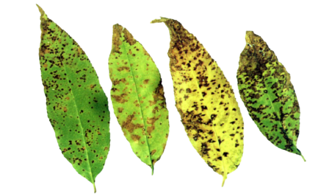
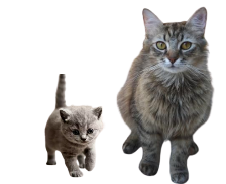

# Project Assignment(EC351)

Implementation of Real-time applications of Sorting Algorithms in image processing under the guidance of Dr. Uma Sheshadri. 

[Project Documentation](https://github.com/P-Chandana/EC351_Algorithms_Virtual_Hackathon/blob/main/Project-report.pdf)   

Implementation_Video : [Here](https://drive.google.com/file/d/1fRBgTfIGBSIq38V5JpnWNTVtxEg31pHd/view)

## Extra Applications Implemented

**Python Libraries used** : OpenCV ,PIL ,Numpy ,Matplotlib ,glob ,collections ,colortheif 

### Identification of Infected leaves ( Sorting Based on dominant color )

Sorting images using colour content in images is very useful in image processing . Using the colortheif library of python we can caluculate the dominant color present in the image.Using this concept of dominant colour we can catogorize leafs based on the color content of brown spots present on the leafs. If the brown color content is more in the image then its mean value of RGB will be less because rgb value of Brown is (39.6, 26.3, 12.9) and rgb value of greeen is (58, 95, 11).In this way we can indentify infected leafs .

Check out the code: [Here](https://github.com/P-Chandana/EC351_Algorithms_Virtual_Hackathon/blob/main/Sorting_by_color.py)

[Implementation_Video](https://drive.google.com/file/d/1ZACbB3Cs7nLc6TiCpt0c9FI7rHzfUt5Y/view)

### Sorting and Searching cats according to their ages 

Its one of the important applications in image processing . Sorting the cats based on their age and size is very useful in IOT for example in smart street lights usage of motion sensor can be modified using the size of the cat or any animal in that case.

But to find the age , we need to use ML algorithms to train the model which can identify the age of the cat . Here we implemented using the background color . We have taken all the images with same shape with different pixel values i.e in a picture where a kitten is present will have more background than a picture of an adult cat . With this logic we sorted the cats based on their ages.

Check out the code: [Here](https://github.com/P-Chandana/EC351_Algorithms_Virtual_Hackathon/blob/main/age.py)

